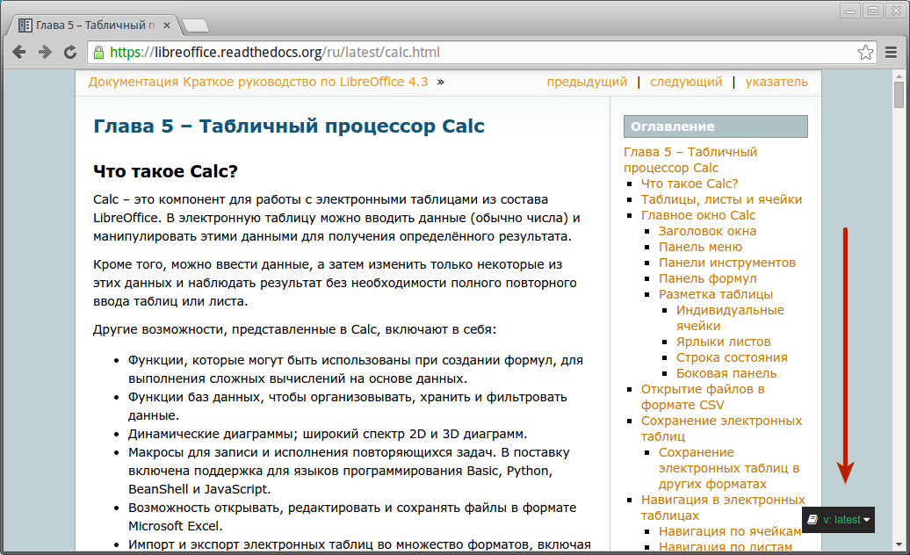
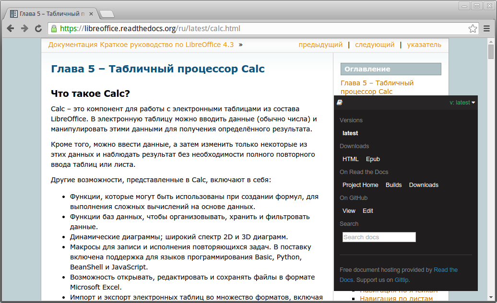

Предисловие
===========

Данное руководство является дополненным и исправленным переводом 5 главы официального англоязычного руководства Getting Started 4.2 (http://www.libreoffice.org/get-help/documentation/). Оно является частью *Краткого руководства по LibreOffice*, перевод которого осуществляется в данный момент.

По ходу повествования будут встречаться ссылки на некоторые разделы «данного» руководства, имеется ввиду краткое руководство по LibreOffice. Оно находится на стадии перевода/адаптации, готовые главы опубликованы на странице https://libreoffice.readthedocs.org.

Также будут встречаться ссылки на полное руководство по LibreOffice Calc. К сожалению, русскоязычного перевода нет и в ближайшее время не планируется.

Все руководства доступны на английском языке: http://www.libreoffice.org/get-help/documentation/

Read The Docs
-------------

Руководство опубликовано с помощью связки reStructuredText, Python Sphinx, GitHub и сервиса Read the Docs. Подробнее об этом можно прочитать в руководстве по генератору документации Sphinx (http://librerussia.blogspot.ru/2014/12/sphinx.html).

Сервис Read The Docs содержит ряд полезных функций. Обратите внимание на темный прямоугольник в правом нижнем углу — нажмите на него. 

    
    Меню Read The Docs

Откроется панель, на которой находятся ссылки для скачивания руководства в различных форматах  другие функции:

    
    Меню Read The Docs

Также обратите внимание на адрес руководства. При копировании ссылки на руководство используйте не весь адрес, а только **http://calc.readthedocs.org**.

Ошибки и опечатки
-----------------

Объемы информации очень большие, а работает над ними всего два с половиной человека. Если вы нашли ошибку, опечатку или любую другую несостыковку, сообщите нам об этом одним из следующих способов:

* оставьте сообщение на форуме в теме: http://forumooo.ru/index.php/topic,4689.msg29027.html;
* отправьте письмо на личную почту редактору: LibreRussia@gmail.com (пожалуйста, указывайте тему сообщения);
* сделайте исправление и вышлите Pull Request (для знатоков :abbr:`ReST (reStructuredText)` и GitHub).

Авторские права
---------------
Руководство распространяется на условиях лицензии «Attribution-ShareAlike» («Атрибуция — На тех же условиях») 4.0 Всемирная (CC BY-SA 4.0) [#]_.

.. [#] http://creativecommons.org/licenses/by-sa/4.0/deed.ru.

Команда
-------

Над руководством работали:

* Роман Кузнецов (перевод, адаптация, вычитка)
* Валерий Гончарук (перевод, адаптация, вычитка)
* Дмитрий Мажарцев (перевод, адаптация, вычитка, вёрстка) 

Дата публикации и версия программного обеспечения
-------------------------------------------------

Опубликовано 12 января 2015 года. Версия программы LibreOffice 4.3.3.2.

Обратная связь
--------------

:Редактор: Дмитрий Мажарцев

:Контакты: LibreRussia@gmail.com

:Блог:  http://libreoffice.blogspot.ru

:Адрес: Волгоград

:Дата: 12 января 2015 года
